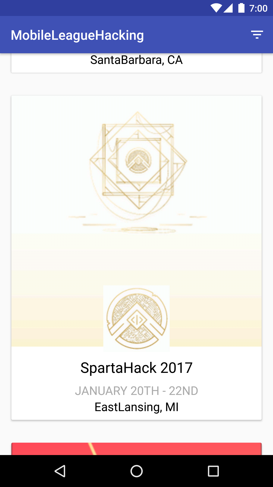
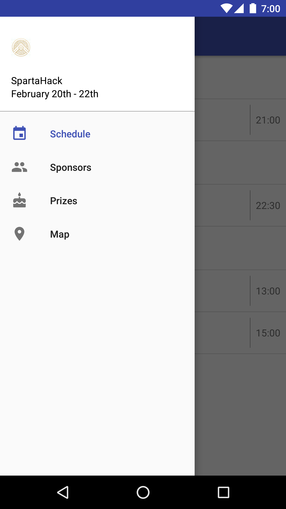
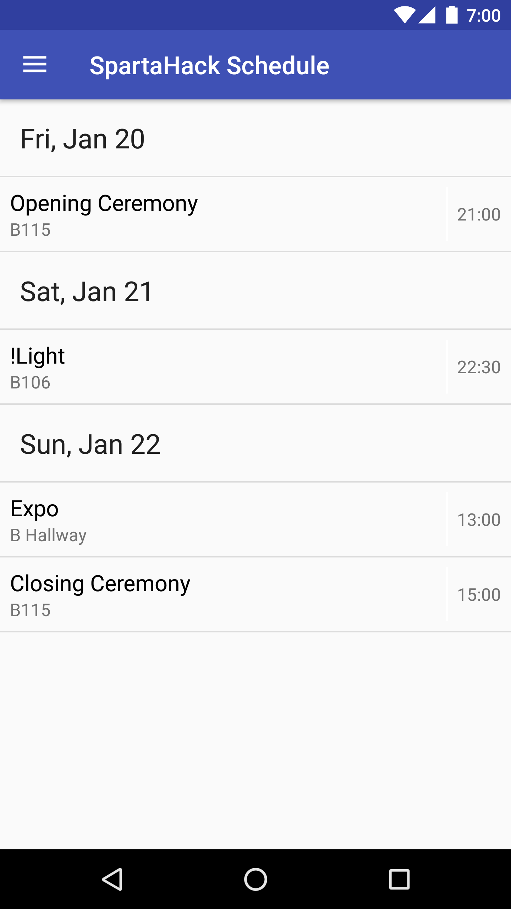
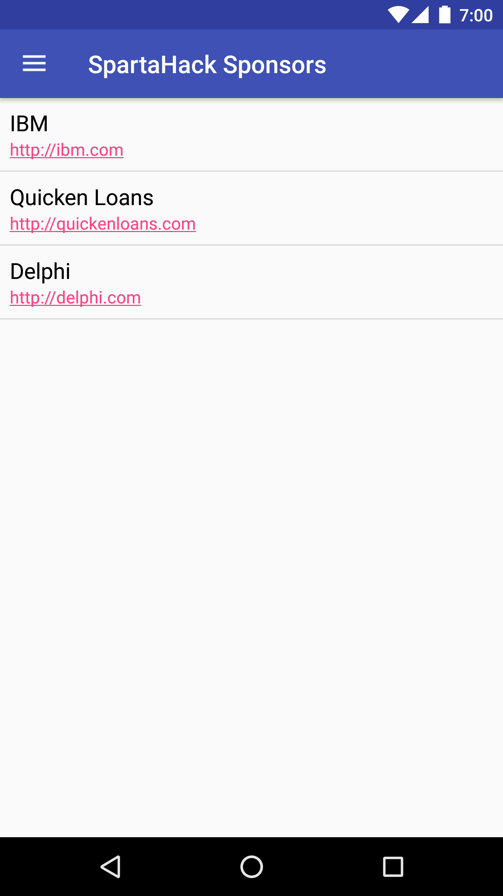
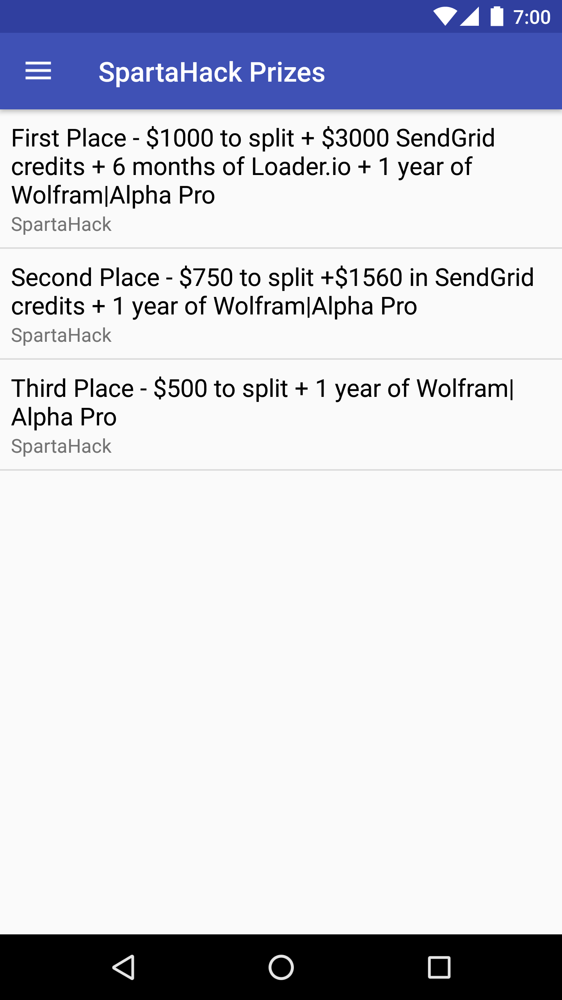
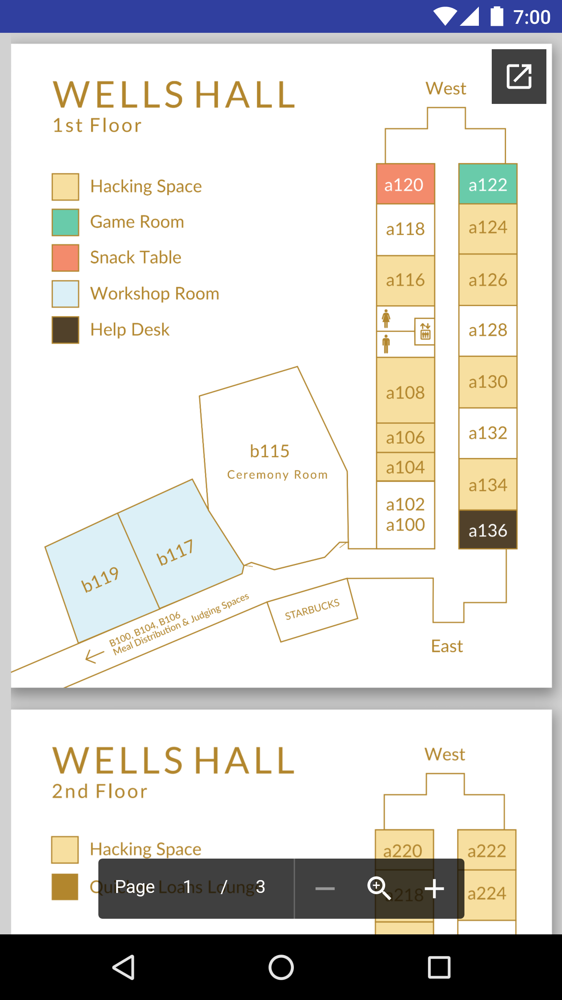

#MobileLeagueHacking

This application is meant to be a centralized mobile application for hackathons. It started out with the main purpose of being an app that would cater to hackathon organizers who did not have mobile apps already, that wanted to enter the mobile space to integrate with their attendees better. In addition, the app can work with events that already have mobile apps by opening them or linking to the playstore as well. You can view the devpost submission <a href="https://devpost.com/software/mobileleaguehacking">here.</a>

##Home

The main activity simply shows a list of available hackathons the user can attend, with options to filter. Below is a screenshot.

##Event Template

For applications that choose to use our mobile app template, below are a few screenshots of what you can expect to see, depending on the information entered by the organizers.

